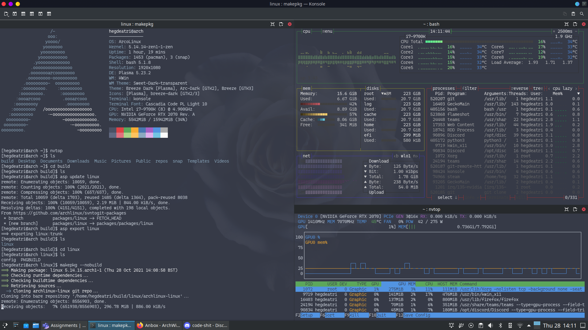
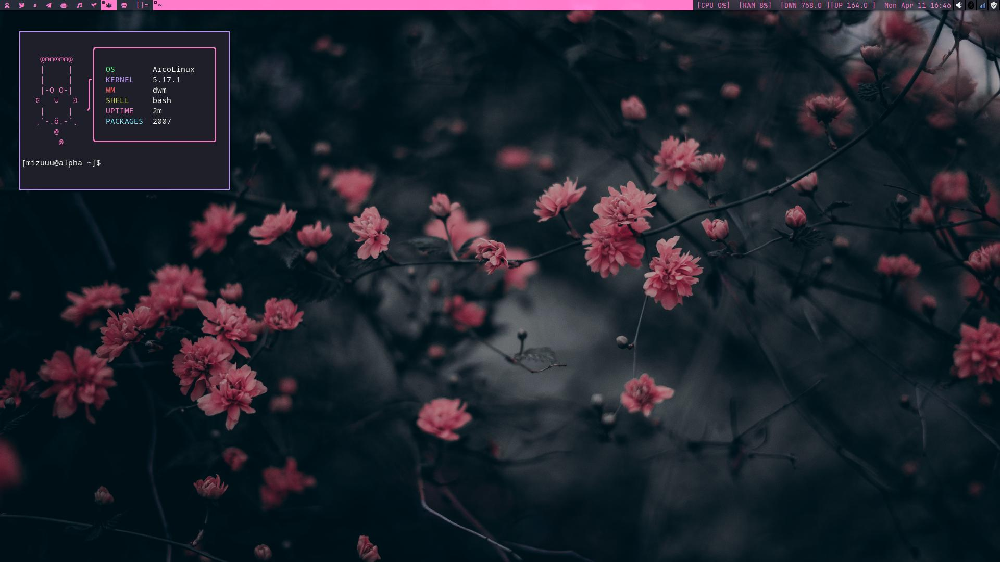
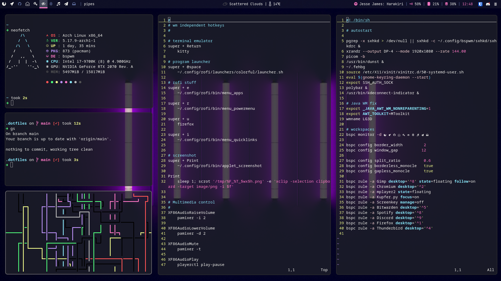

+++
title = "What using Linux has taught me."
description = "Things learnt after about 10 months of using Arch linux."
date=2022-06-30
[taxonomies] 
categories = ["Post"]
tags = ["Arch Linux"]
+++

About 10 months ago last year I went from using Windows 10 and trying out Arch Linux with basically
no prior knowledge, threw myself into the deep end by using ArcoLinuxB with the KDE Plasma desktop
environment. I have always dual booted windows, simply because some games I play do not have anti-cheat
support on the linux. That being said, for the first month I barely booted into linux, however towards the
end of the month, I started 'ricing' my computer. This initially increased my usage and exposure.
You can see one of my first times messing around with linux.

At this stage, I was just getting started learning about the FOSS community and the actual benefits of
using linux. However this was just the start of my journey.

After 3-4 months of using KDE, I stumbled upon the concept of 'tiling window managers'. In particular
[dwm](https://dwm.suckless.org/), a [suckless](https://suckless.org) software. I had watched this 
[video](https://www.youtube.com/watch?v=wRh8HQ4ICwE), where the youtuber 'Mental Outlaw' basically
showcased dwm, and he totally sold it to me! I installed ArcoLinux with dwm and started messing around with it.
I also came across a patching guide on youtube for dwm which I followed and started to get into the nitty
gritty of linux, being able to do everything I needed to from the terminal. You can find my suckless utility 
repos on my github ([dwm](https://github.com/hegde-atri/dwm), [dmenu](https://github.com/hegde-atri/dmenu), 
[dwmblocks-async](https://github.com/hegde-atri/dwmblocks-async)).

Now I reinstalled vanilla arch, using the installation guide, succeeded on my third try after about 4 hours.
DWM is a fantastic window manager, except for the fact that I could not get the system tray patch to work.
No matter which order I applied it, and manual intervention never worked out for me, so I tried out bspwm!

This was about 8 months into using ArchLinux. I had made my own [arch-install](https://github.com/hegde-atri/arch-install)
script and was starting to manage my [dotfiles](https://github.com/hegde-atri/dotfiles).
I have now switched from dwm to bspwm, and have loved it! It does everything I need it to do, and I like using
polybar, sxhkd and rofi. I have also discovered a lot of useful FOSS alternatives to proprietary software I 
had been using before.

I am now almost always booting into linux, although sometimes I do boot into windows to play games that need anti-cheat. I have started to
use neovim properly as my 'IDE'. After messing around with a custom nvim config, I started using Astronvim, 
which was excellent. However I am learning emacs(doom-emacs) in particular, and also made my own dotfiles switching
script, however I want to replace that soon with something more stable and easier to deploy. I am slowly growing
out of my 'aesthetic' phase and willing to sacrifice looks for something more efficient, or fits into my workflow better. I also seem to not be able to use proper desktop environments, as they seem too slow now.

Overall, I am very glad I tried out using arch linux, just so i could say 'I use arch btw.' to actually learning
to love this distribution, before ArcoLinux, I had tried out several other repos, essentially distrohopping between
fedora, popOS, and manjaro. However I also had recommended trying this out to a few friends, and realized after
a few months that just using linux is not for everyone, some people just love ~~Microsoft collecting their data~~
the ease of using windows, just works for them. But always do recommend it to them without forcing it onto them
as when it is forced, and something goes wrong, especially if they start out with Arch, it will stain 'linux' and
free software in general for them. With that being said, If you haven't tried out arch linux already, I recommend
trying it out with something like popOS and then when your comfortable with it and want to use a minimalist distro,
checking out ArchLinux!

