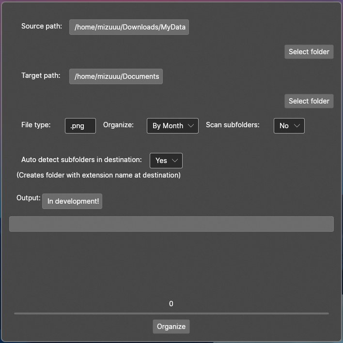

+++
title = "File Organizer"
description = "How to use my File Organizer application"
date=2022-06-21
[taxonomies]
categories = ["C#"] 
tags = ["C#", "File Handling"] 
[extra]
toc = true
+++

# [File Organizer](https://github.com/hegde-atri/FileOrganizer)

A C# application written using the Avalonia framework. It was made when I had recovered over 2TB of data from a hard drive all into one folder.

This application organizes files in a folder based on specified options.

## Preview

## How to use
You can download the application from the [releases page.](https://github.com/hegde-atri/FileOrganizer/releases)

- You select the source and target paths by clicking on the select folder button below their label.
- If you want to sort all files in the source path, leave file type empty. If you want to only sort 1 type of file, then type its extension in the file type box. Example: ".jpg"
- You can organize by the month and year, or only the year of the file taken from the last modified metadata property. If None is selected, the selected file type will just be moved to Target path.
- Scan subfolder:  checks for files inside of folders in the source path.
- Auto detect subfolders: creates folders at the target path for every extension it finds.

Then press Organize, you should be able to see the progress in the progress bar and its percentage right above it.

## Disclaimer
- There is not enough validation checks so make sure to test it with small sample to see if it works as intended.
- I do not know how to package MacOS' release files, so it most probably will not work on macOS.
- If moving fails, then your files should be safe. Some will be in the target path, and the rest in the source path (the failed to move files.)
If this happens, please send me the Exception.txt file created in the target path.